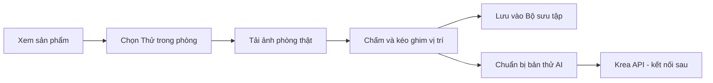

# furniture-store (FurneeHome)

FurneeHome là website giúp học sinh, sinh viên và người ở phòng nhỏ chọn sản phẩm, đánh dấu vị trí muốn đặt trên ảnh phòng thật rồi tạo bản xem thử bằng AI.

## Luồng sử dụng



## Các trang

| Chức năng | Route | Source |
|---|---|---|
| Trang chủ | `/` | `client/src/pages/HomePage.jsx` |
| Danh sách sản phẩm | `/products` | `client/src/pages/ProductListPage.jsx` |
| Bộ sưu tập | `/collection` | `client/src/pages/CollectionPage.jsx` |
| Phòng thử | `/room-studio` | `client/src/pages/RoomStudioPage.jsx` |
| Quản trị | `/admin` | `client/src/pages/AdminPage.jsx` |
| Không tìm thấy | `*` | `client/src/pages/NotFoundPage.jsx` |

Đăng nhập hiển thị bằng modal trên trang hiện tại. Route cũ `/cart` và `/room-3d` chỉ chuyển tiếp sang route mới để không làm hỏng đường dẫn đã lưu.

## Tài khoản thử

- Customer: bấm nút `Customer` trong hộp đăng nhập.
- Admin: bấm nút `Admin` trong hộp đăng nhập.
- Có thể nhập email bất kỳ để thử role Customer.
- Email `admin@furneehome.vn` với mật khẩu `admin123` dùng role Admin trong bản frontend hiện tại.

Đây chưa phải xác thực thật. Dữ liệu đăng nhập chỉ được lưu trên trình duyệt.

## Dữ liệu mẫu

- 10 sản phẩm nằm trong `client/src/data/sampleProducts.js`.
- Ảnh chiếc bàn thật nằm trong `client/public/images/products/desk-4060.png`.
- Những sản phẩm còn lại dùng hình minh họa tạm.
- Thẻ sản phẩm có nút tìm kiếm trên Shopee; riêng bàn 40 × 60 cm có thêm hai liên kết sản phẩm tham khảo.
- Trang quản trị có thể thêm, sửa, xóa và khôi phục dữ liệu mẫu.
- Tất cả thay đổi hiện lưu bằng `localStorage`, chưa đưa lên MongoDB.

## Cấu trúc chính

```text
client/
├── public/images/          # Ảnh tĩnh
└── src/
    ├── components/         # Component dùng lại
    ├── context/            # Auth, sản phẩm mẫu, Bộ sưu tập
    ├── data/               # 10 sản phẩm mẫu
    ├── pages/              # Mỗi page tương ứng một route
    ├── services/           # Nơi gọi API thật sau này
    ├── styles/             # Theme và CSS chung
    ├── utils/              # Hàm tiện ích
    ├── App.jsx
    ├── main.jsx
    └── router.jsx

server/
└── src/
    ├── config/
    ├── models/
    ├── controllers/
    ├── routes/
    ├── services/
    ├── middleware/
    ├── utils/
    ├── app.js
    └── server.js
```

## Chạy project

Frontend:

```bash
cd client
npm ci
npm run dev
```

Backend chỉ cần chạy khi thử API/MongoDB:

```bash
cd server
npm ci
npm run dev
```

## Ba bộ lệnh dành cho thành viên

### 1. Chỉ lấy code mới từ nhánh của mình

```bash
git switch ten-nhanh-cua-ban
git pull origin ten-nhanh-cua-ban
```

### 2. Lấy code mới và cài đúng package-lock.json

```bash
git switch ten-nhanh-cua-ban
git pull origin ten-nhanh-cua-ban
cd client
npm ci
cd ../server
npm ci
```

### 3. Đẩy phần đã làm lên nhánh của mình

```bash
git switch ten-nhanh-cua-ban
git add .
git commit -m "Mo ta ngan gon phan da lam"
git push origin ten-nhanh-cua-ban
```

Lệnh chia nhánh và merge dành cho trưởng nhóm sẽ được hướng dẫn riêng để README không làm các thành viên bị rối.

## Thiết lập lần đầu cho thành viên

Mỗi thành viên dùng đúng nhánh cá nhân do trưởng nhóm đã tạo. Thay `feature/ten-thanh-vien` bằng tên nhánh được giao.

```powershell
git clone https://github.com/xinchaotamhon/furneeHome.git
cd furneeHome
git fetch origin
git branch -r
git switch --track origin/feature/ten-thanh-vien
cd client
npm ci
cd ..\server
npm ci
```

`client` và `server` có `package.json` cùng `package-lock.json` riêng, nên phải chạy `npm ci` ở cả hai thư mục. Không gửi hoặc commit `node_modules`, không commit `.env`. Thành viên chỉ push lên nhánh cá nhân; `main` do trưởng nhóm quản lý và trưởng nhóm sẽ tự merge.

## Quy tắc package và biến môi trường

- Frontend chỉ cài package trong `client`; backend chỉ cài package trong `server`.
- Không sửa `package-lock.json` bằng tay.
- Không commit `.env`.
- `client/.env.example` chỉ chứa địa chỉ backend.
- MongoDB URI, JWT secret và Krea API key sau này chỉ đặt trong `.env` của backend.

## Tài liệu project

- `G5_furniture-store_Review_1_2_VI.docx`: bản tiếng Việt để nhóm kiểm tra.
- `G5_furniture-store_Review_1_2_EN.docx`: bản tiếng Anh dễ đọc, dễ thuyết trình.
